# UtilityViews

UtilityViews is a framework of useful and commonly used views. 

**This is a work in progress - it is being developed along side a somewhat larger project** - I only intend
to push code that works with my app, but the interface _may_ change. I'm trying to ensure that there are no breaking changes as I go along, but cannot make any guarantees.

I have included developer documentation in the source that shows how to use the components and every
Component has a corresponding test view in the test app. 

## Overview

There are many views that appear in a number of apps where it makes sense to make them generic and reuse
the code. This framework contains a number of such views, ranging from simple text display views to more
complex picker views involving a significant amount of code. 

The framework came about as a result of me trying to create a *significant* iOS app instead of my usual
trivial apps. While creating it, I realised that I was creating a number of views that I had created several
times before in different projects, so this presented me with the perfect opportunity to experiment with
creating a framework. That led me to reading up on XCFramework and that led to this project.

I've used these views in my Remote Control Aircraft Flight Log project. They've proved very useful. 

Please feel free to dig around in the code and take what you want from it. Bear in mind I'm a novice so the code 
may not be as optimised as you might expect from a professional. I'm doing my best to transition from 
processional coding in a Windows/C# environment to an Apple/SwiftUI environment. The concepts are similar
but the implementation vastly different.

You'll find a shell command (BuildUtilityViews.sh) that builds the xcframework in the UtilityViews folder.

### KeyValueView

KeyValueView lets you display a key/value pair where the key can be either a string or an image. The key is
displayed on the left and the value on the right.

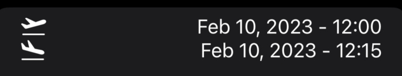

### CheckBoxView

CheckBoxView is used when you want to show a text (key) value along with a boolean value to show state.

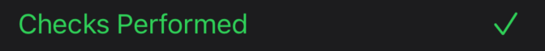

### DateTimePickerButton

The DateTimePickerButton is used in conjunction with the ``DateTimePopup`` to present a 'button' that thge user can
tap to display a popup date/time selector. The button handles the date not being set.

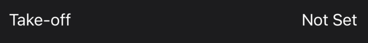

### DateTimePopup

Used in conjunction with the ``DateTimePickerButton`` the DateTimePopup presents a modal view to the user to select a date/time 
value. The code also handles tghere being no starting date and sets limits on what dates can be selected.

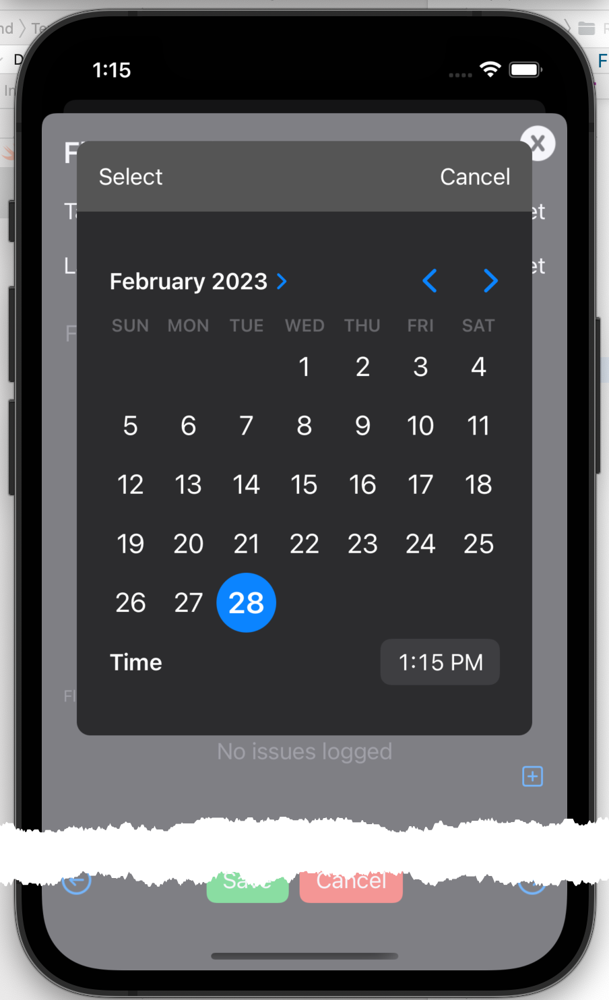

### XDismissButton

XDsmissButton provides a consistently styled image to be used in conjunction with an overlay to close
a popup modal.

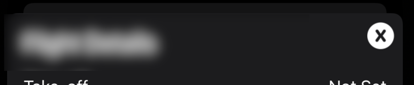

### TextEdit

The TextEdit component provides a text input component that accepts multiple lines of text
with the advantage of having place holder text.

 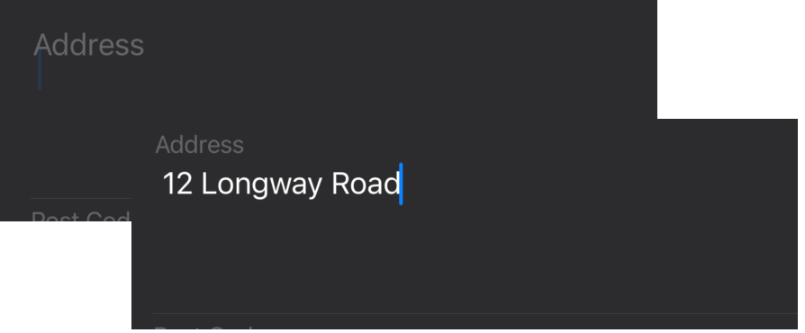

### FloatingTextView

FloatingTextView is a variation on the standard TextInput input component that keeps the placeholder text visible
 on screen as the user types their input.

 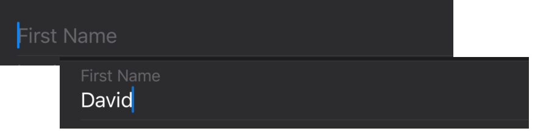
 
### Image Picker

The image picker allows the user to select an image from their photos library or to take a picture with the camera. 

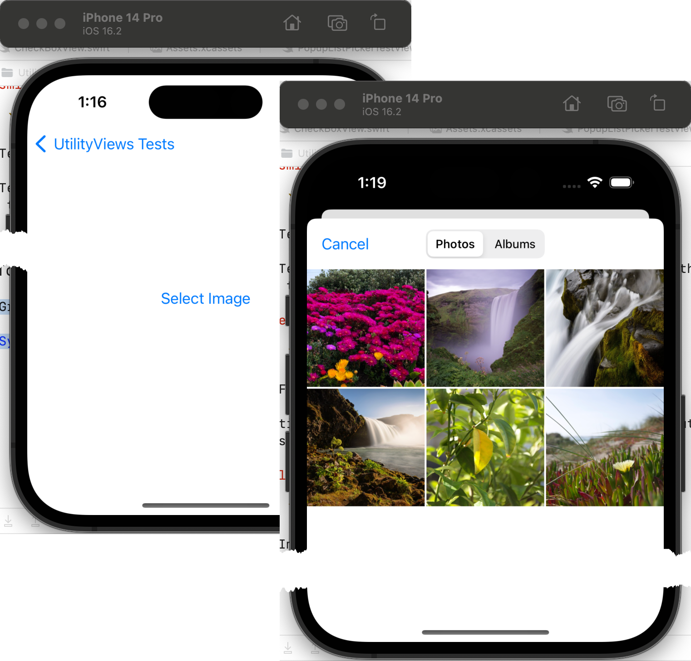

### Popup List Picker

There are times when you want to be able to display a more complex picker than is available in the standard
set of components. This component is a combination of ``PickerPopupButton`` for displaying a complex
button and ``PickerPopup`` for displaying a list of options to pick from. Each option will consist of
three items;

* An image
* A title
* A sub-title

These are reflected in the button, so the user can always see what the current selection is.

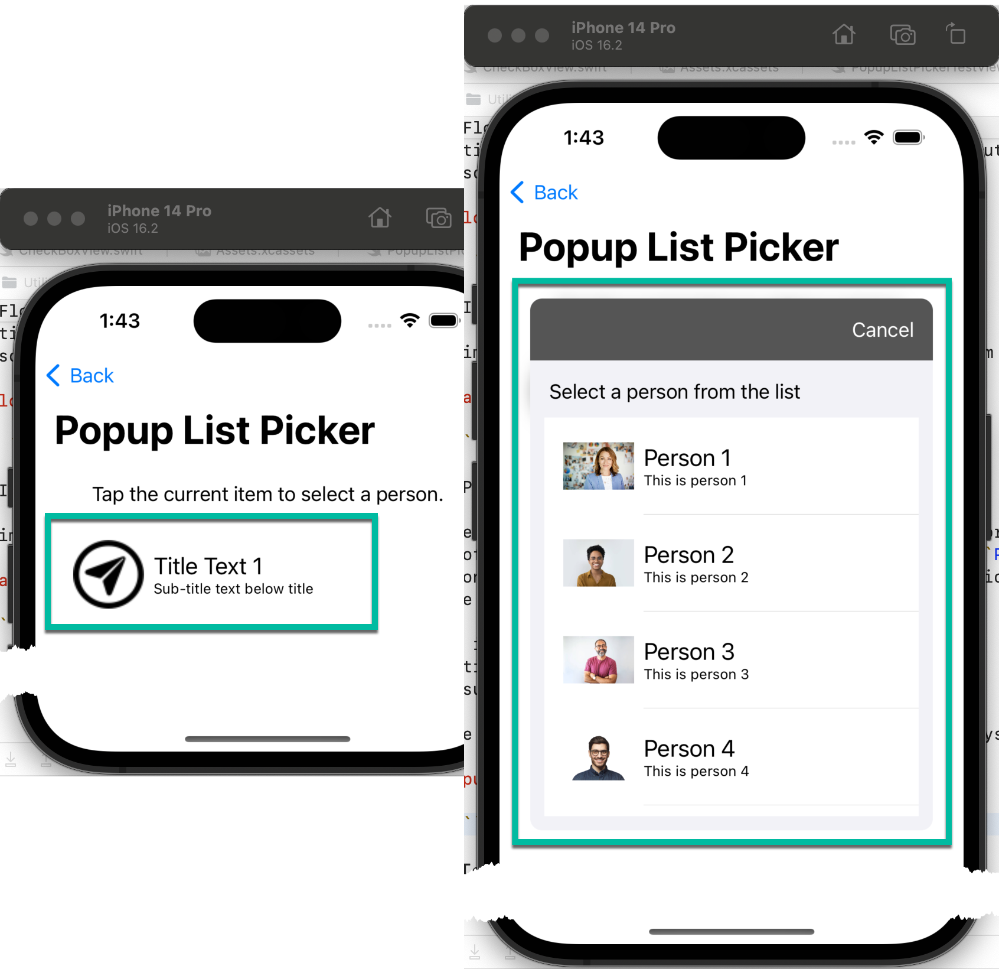

## Updates 

This framework was always intended to grow, and it has. This section shows any updates since the initial version was created.

### segmentedView

  started out with a multi-page input form which I wrapped in a 
 ScrollView to the user could scroll between pages. It worked Ok, but
 was less than intuitive. I needed a better way to indicate to the user that there
 were multiple pages and to give them a more intuitive way to access them. The
 SegmentedView was the result.

It comes in two variants. The first uses text with an underline to
indicate the current item. When a new item is selected, the underline
scrolls to the selected item giving the user some animation feedback.

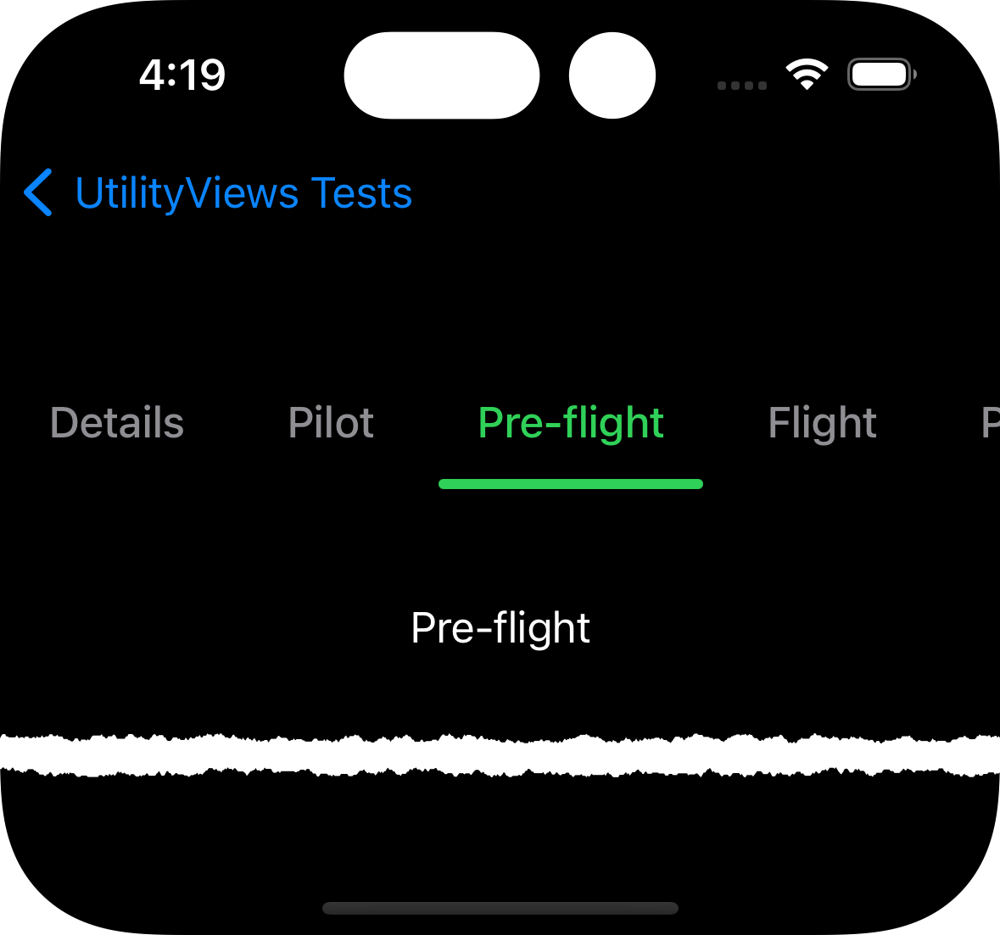

The second is a more traditional pill style. When an item is selected
it is highlighted with a background pill shape and the surrounding items are moved
slight further away. This gives the user a minimal and subtle indication that
the selection has changed.

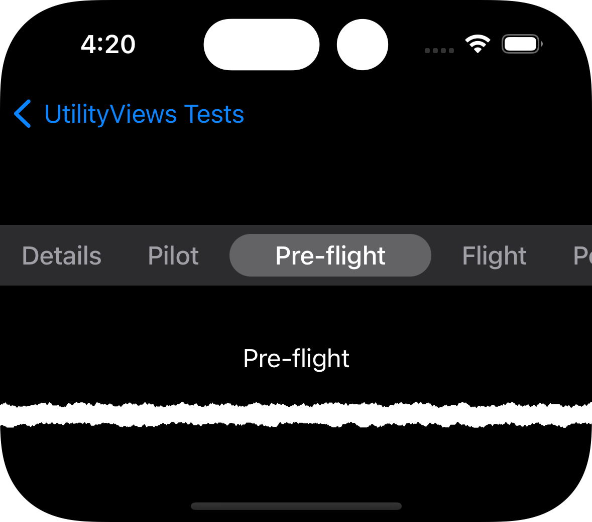

